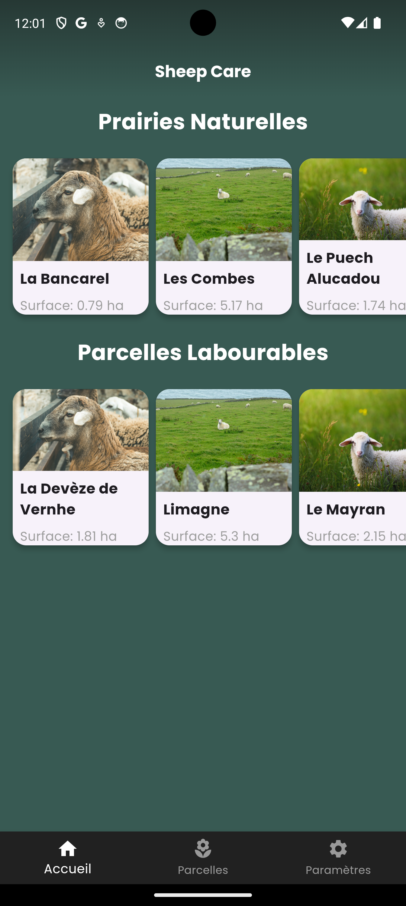
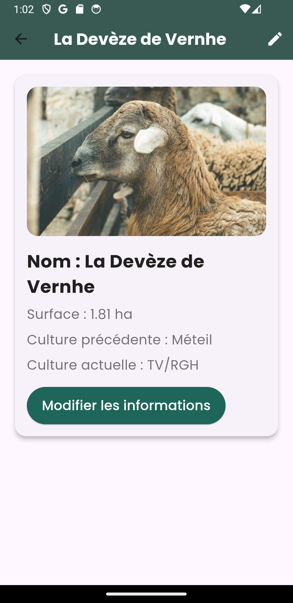
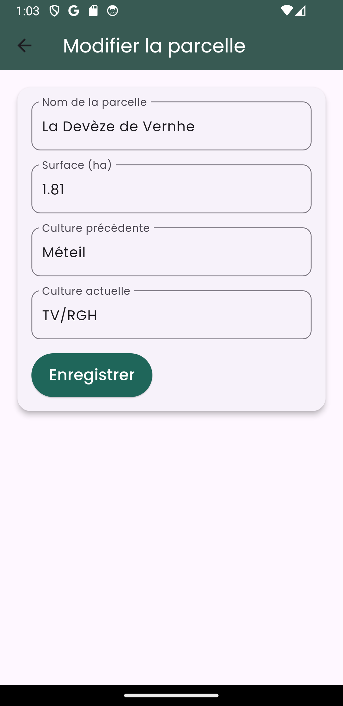

# 🐑 Sheep Care

## Application mobile pour la gestion d'une ferme de brebis à "Lagnac" en Aveyron, située à Rodelle

**Sheep Care** est une application mobile conçue pour aider le paysan à gérer efficacement la ferme de brebis. Sheep Care lui offrira des outils simples et intuitifs pour suivre les 1000 brebis, gérer les parcelles et leur plantation ainsi que gérer les stock.

<div style="display: flex; justify-content: center;">
    &nbsp;&nbsp;&nbsp;&nbsp;&nbsp;
    &nbsp;&nbsp;&nbsp;&nbsp;&nbsp;
    
</div>

## 🌟 Fonctionnalités

- **Gestion des brebis** 🐑 : Suivre l'état de santé des brebis et gérez leurs informations.
- **Suivi des parcelles** 🌾 : Garde une trace en BDD firebase des parcelles de terre et des cultures plantées.
- **Notifications** 🔔 : Recois des rappels via des notifications pour les soins à apporter aux brebis et aux cultures.

## 📱 Captures d'écran

### Écran de connexion
L'écran de connexion permet d'accéder facilement à sont compte afin de gérer la ferme.


### Écran de chargement
Un écran de chargement convivial pour une meilleure expérience utilisateur lors de la connexion.


## 🚀 Getting Started

Ce projet est un point de départ pour une application Flutter, mais il s'avérera utile pour tous ceux qui souhaitent gérer leur ferme de manière efficace et moderne..

### Quelques ressources pour vous aider à démarrer si c'est votre premier projet Flutter :

- [Lab : Écrivez votre première application Flutter](https://docs.flutter.dev/get-started/codelab) 📚
- [Cookbook : Exemples utiles de Flutter](https://docs.flutter.dev/cookbook) 📖

Pour obtenir de l'aide sur le développement Flutter, consultez la [documentation en ligne](https://docs.flutter.dev/), qui offre des tutoriels, des exemples, des conseils sur le développement mobile, et une référence complète de l'API.

## 💻 Installation

Pour installer ce projet sur votre machine locale, suivez ces étapes :

1. Clonez ce dépôt :
```bash
git clone https://github.com/mikaelvery/sheep_care.git
```
Accédez au répertoire du projet :
```bash

cd sheep_care
```
Installez les dépendances :
```bash
flutter pub get
```
Exécutez l'application :
```bash
flutter run
```
## 🤝 Contribution

Les contributions sont les bienvenues ! Si vous avez des suggestions ou des améliorations, n'hésitez pas à soumettre une Pull Request.

📄 License
Ce projet est sous licence MIT. Consultez le fichier LICENSE pour plus de détails.