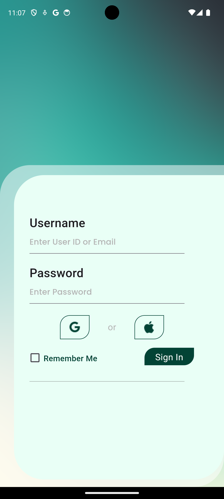

# Sheep Care

## A new Flutter project.

Sheep Care est une application mobile conçue pour aider les utilisateurs à gérer efficacement leurs fermes de brebis. Que vous soyez un éleveur expérimenté ou que vous débutiez dans l'élevage, Sheep Care vous offre des outils simples et intuitifs pour suivre vos brebis, gérer les parcelles et optimiser la production.


## Fonctionnalités

- **Gestion des brebis** : Suivez l'état de santé de vos brebis et gérez leurs informations.
- **Suivi des parcelles** : Gardez une trace des parcelles de terre et des cultures plantées.
- **Notifications** : Recevez des rappels pour les soins à apporter aux brebis et aux cultures.



## Capture d'écran

### Écran de connexion
L'écran de connexion vous permet d'accéder facilement à votre compte et de commencer à gérer votre ferme.


### Écran de chargement
Un écran de chargement convivial pour une meilleure expérience utilisateur lors de la connexion.

## Getting Started

Ce projet est un point de départ pour une application Flutter.

### A few resources to get you started if this is your first Flutter project:

- [Lab: Write your first Flutter app](https://docs.flutter.dev/get-started/codelab)
- [Cookbook: Useful Flutter samples](https://docs.flutter.dev/cookbook)

Pour de l'aide sur le développement Flutter, consultez la [documentation en ligne](https://docs.flutter.dev/), qui offre des tutoriels, des exemples, des conseils sur le développement mobile, et une référence complète de l'API.

## Installation

Pour installer ce projet sur votre machine locale, suivez ces étapes :

1. Clonez ce dépôt :
   ```bash
   git clone https://github.com/votre-utilisateur/sheep_care.git
